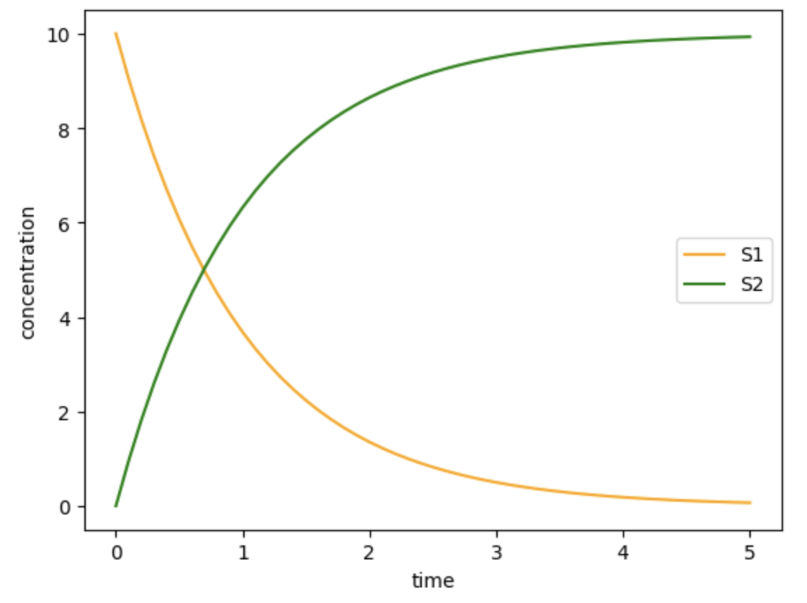

Basic Usage
===========

.. highlight:: python
   :linenothreshold: 5

The basic usage of ``controlSBML`` involves wrapping an SBML
simulation as a ``control`` package object,
and then using the tools in the ``control`` package.
The details are:

1. Construct a ``ControlSBML`` object for the SBML model.

2. From this object, obtain objects used in the CalTech package:

   a. ``NonlinearIOSystem`` object that wraps the entire SBML model; and

   b. ``StateSpace`` object that is a linear approximation to the SBML model

3. Do control analysis and design using the ``control`` package.

The basic usage involves steps 2 and 2a above.

In the sequel, we use the following simple example of
an Antiimony representation of a model.

.. code-block:: python

    SIMPLE_MODEL = """
        species E1;
        J1: S1 -> S2; S1*E1
        S1 = 10; S2 = 0; E1 = 1;
    """

``ControlSBML`` Constructors
############################
We begin with constructing a ``ControlSBML`` object.
This requires having a representation of an SBML model.
This can be an XML file, an XML URL, an antimony file,
or a ``libroadrunner`` object.
We refer to any of these representations of the SBML model as
a *reference*.
The following constructs ``ControlSBML`` object for this model.

.. code-block:: python

    ctlsb = ctl.ControlSBML(SIMPLE_MODEL)

This object has a number of useful properties.

* ``ctlsb.antimony`` is the Antimony representation, even if the reference is an XML file or a ``libroadrunner`` object.
* ``ctlsb.roadrunner`` is the ``libroadrunner`` object.
* ``ctlsb.state_ser`` is a ``pandas`` ``Series`` that provides the values of the concentrations of floating species (the state variables).
* ``ctlsb.setTime(time)`` runs the simulation to a desired time. This updates ``ctlsb.state_ser``.

To create an object that is more useful for control analysis,
you should specify at least one *input* and at least one *output*.
An input is a chemical species that can be manipulated by
increasing or decreasing its value.
An output is a chemical species or reaction flux that can be
read.
An example of this constructor is:

.. code-block:: python

    ctlsb = ctl.ControlSBML(SIMPLE_MODEL,
        input_names=["E1"], output_names=["S2"])

Note that both ``input_names`` and ``output_names``
are lists of strings.
Inputs and outputs must be specified to make use of
subsequent capabilities of ``ControlSBML``.

Using ``controls.NonlinearIOSystem``
#####################################################

The following code fragment does a simulation using
the ``control`` package and plots
the output.

.. code-block:: python

    # Inputs and outputs
    input_names = ["E1"]
    output_names = ["S1", "S2"]
    # Create the ControlSBML and NonlinearIOSystem objects
    ctlsb = ctl.ControlSBML(SIMPLE_MODEL,
          input_names=input_names, output_names=output_names)
    sys = ctlsb.makeNonlinearIOSystem("simple")
    # Start simulation at time 0
    ctlsb.setTime(0)
    # Do the simulation using the controls package
    times = [0.1*n for n in range(51)]
    output = control.input_output_response(sys,
          times, X0=ctl.makeStateVector(sys))
    # Plot the result
    colors = ["orange", "green"]
    for idx in range(len(output_names)):
        plt.plot(times, output.outputs[idx,:], c=colors[idx])
    _ = plt.legend(output_names)
    plt.xlabel("time")
    plt.ylabel("concentration")

Below, we provide some details about this script.
In line 5,
``ctlsb`` is constructed to have the input ``E1`` and the outputs ``S1`` and ``S2``.
And, in line 7, ``sys`` is a ``control.NonlinearIOSystem`` object
that wraps the SBML model.
Line 9 sets the start time of the simulation to time 0
(which isn't necessary if ``sys`` is referenced only once).
The simulation using the ``control`` package is done
in line 12.
This requires specifying the times at which simulation results are
to be produced.
It also requires specifying the initial state of the ``NonlinearIOSystem``
object.
This state is obtained from the method ``ctl.makeStateVector``.
The output from the simulation is a two dimensional array since
there are two outputs.
``outputs[0, :]`` is ``S1``, and
``outputs[1, :]`` is ``S2``.
Below is the plot constructed by running this script.

