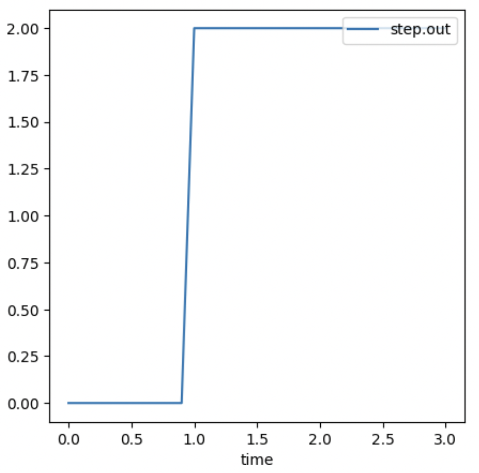
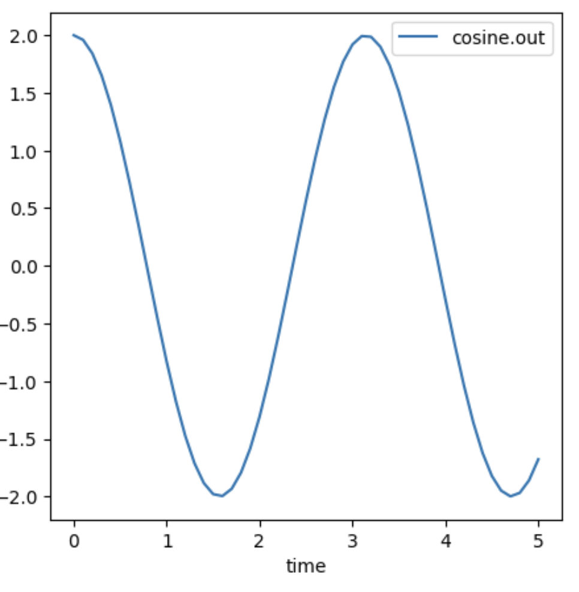
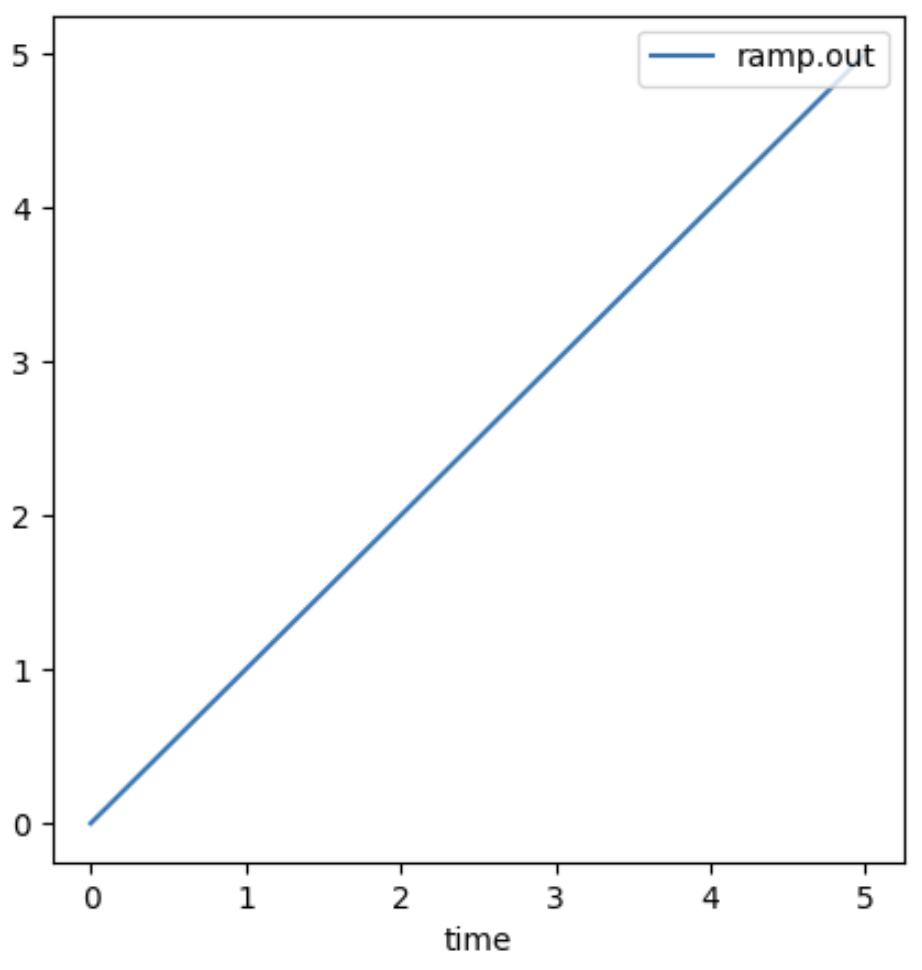
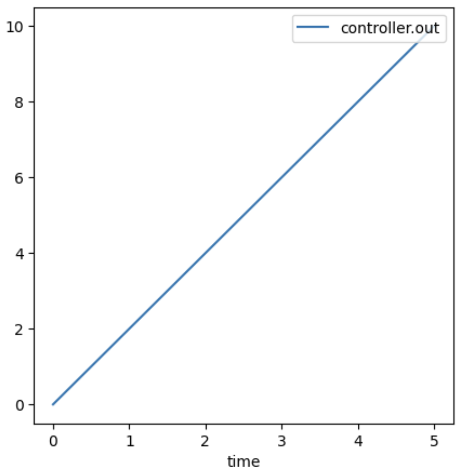
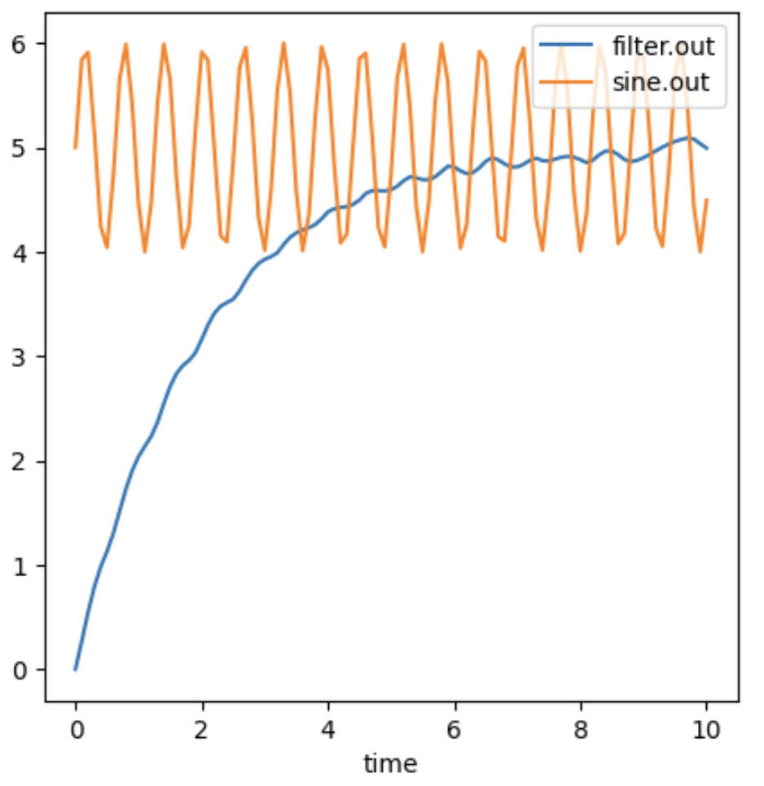
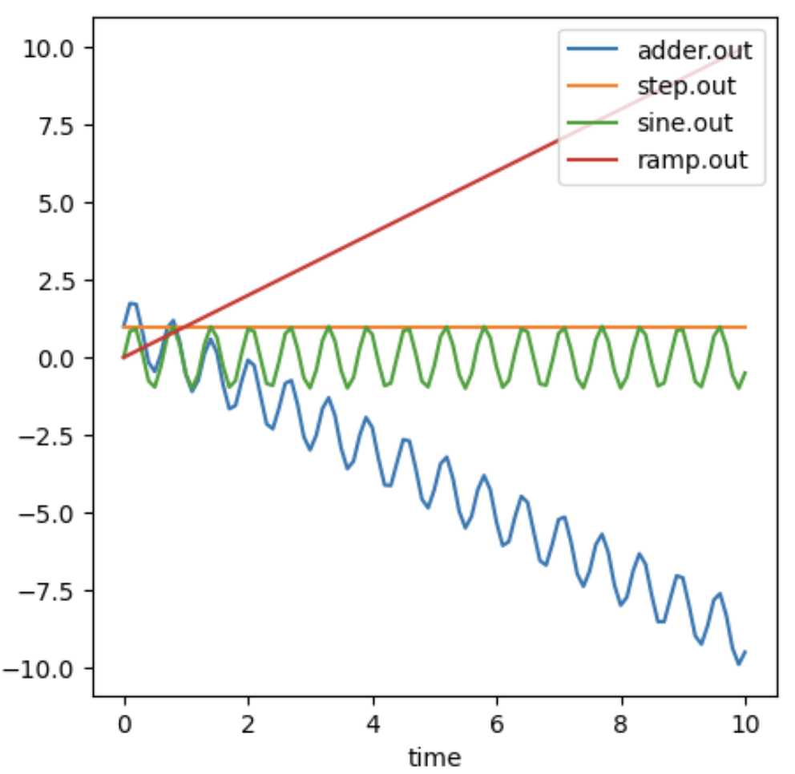
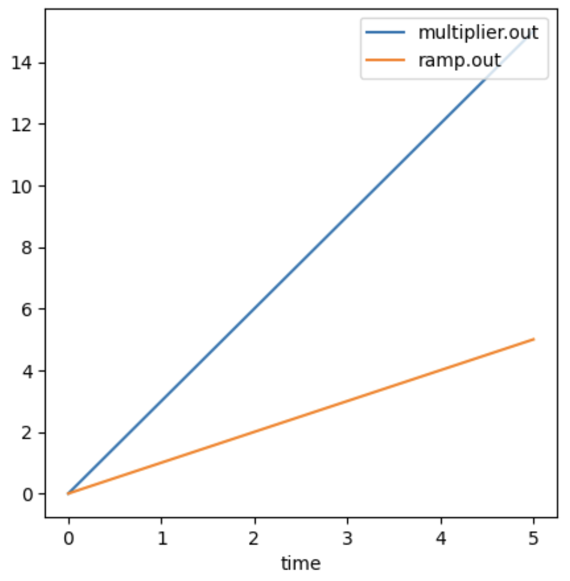

Element Factories
=================

.. highlight:: python
   :linenothreshold: 5

.. toctree::
   :maxdepth: 3

``ControlSBML`` provides factories for making elements of closed loops.
Elements constructed from these factories are ``control.NonlinearIOSystem`` objects.
Elements are classified as signal generators that produce a signal or system elements that transform signals.

* Signal generators
    * Step
    * Sine
    * Arbitrary signal
* Systems
    * PID controller
    * Filter
    * Adder
    * Multiplier
    * Passthru 

All factory methods have a single positional argument: the name of the element, and they
return an ``NonlinearIOSystem`` with the specified names and names for its inputs and outputs.

Signal generators
#################
All signal generator factories
have the keyword arguments
``start_time`` (which defaults to 0) and ``end_time`` (which defaults to ``None``).
Signal generator factories also have keyword arguments
that specify specifics of the signal.
The factory returns an ``NonlinearIOSystem`` that has
no input and a single output named ``out``.

Step
^^^^
``makeStep`` is a factory that creates step signals.
It has the signal specific keyword argument ``step_size`` that specifies the
magnitude of the step. The code below illustrates the creation of a step signal generator for
a step of size 3 that starts at time 1 and ends at time 3.

.. code-block:: python

    factory = ctl.IOSystemFactory()
    step = factory.makeStep("step", 2, start_time=1, end_time=3)

.. end-code-block

Below is an example of creating an ``control.InterconnectedSystem`` that consists only of a step function. Then, we plot the result.

.. code-block:: python

    # Create an InterconnectedSystem
    connected_system = control.interconnect(
    [step],       # systems
    outlist=["step.out"],
    )
    # Simulate the system and plot the result.
    ts = ctl.simulateSystem(connected_system, output_names=["step.out"], end_time=end_time)
    ctl.plotOneTS(ts, figsize=(5,5))

.. end-code-block

Sinusoid
^^^^^^^^ 

``makeSinusoid`` is a factory that creates sinusoid signals and has the keyword arguments ``amplitude``, ``frequency``,
``phase``, and ``dc_offset`` (cosntant addition to the sinusoid).
Below is an example of creating a cosine.

.. code-block:: python

    factory = ctl.IOSystemFactory()
    cosine = factory.makeSinusoid("cosine", amp=2, frequency=2, phase=np.pi/2)

.. end-code-block

Below is an example of creating an ``control.InterconnectedSystem`` that consists only of a step function. Then, we plot the result.

.. code-block:: python

    # Create an InterconnectedSystem
    connected_system = control.interconnect(
    [cosine],       # systems
    outlist=["cosine.out"],
    )
    # Simulate the system and plot the result.
    ts = ctl.simulateSystem(connected_system, output_names=["cosine.out"])
    ctl.plotOneTS(ts, figsize=(5,5))

.. end-code-block

Arbitrary Signal
^^^^^^^^^^^^^^^^
``makeArbitrarySignal`` is a factory that creates a signal specified in a user provided function.
It has the keyword argument ``signal_function`` that specifies the function that defines the signal.

We illustrate this factory by creating an ``NonlinearIOSystem`` object that generates a ramp.
The ``signal_function`` is

.. code-block:: python

    # Make a unit ramp
    def rampFunction(time):
        return time

.. end-code-block

Creating the ramp generator is illustrated below.

.. code-block:: python

    factory = ctl.IOSystemFactory()
    ramp = factory.makeArbitrarySignal("ramp", signal_function=rampFunction)

.. end-code-block

Here's an example of constructing a system with ``ramp`` and simulating the system.

.. code-block:: python

    # Create an InterconnectedSystem
    connected_system = control.interconnect(
    [ramp],       # systems
    outlist=["ramp.out"],
    )
    # Simulate the system and plot the result.
    ts = ctl.simulateSystem(connected_system, output_names=["ramp.out"])
    ctl.plotOneTS(ts, figsize=(5,5))

.. end-code-block

System generators
###################
Systems are elements that transform signals.
``NonlinearIOSystem`` objects constructed by system factories have
one or more input and one or more output.
Elements with a single input and a single output use the names ``in`` and ``out``.

PID controller
^^^^^^^^^^^^^^
Proportional, integral, and differential (PID) control is widely used in control systems.
The factory ``makePIDController`` 
has the keyword arguments
``kp``, ``ki``, and ``kd`` that correspond to the parameters of a
PID controller.
The default value of these arguments is 0 to facilitate making various combinations of
proportional, integral, and differential control.
Below is an example of construcing a proportional controller with a gain of 2.
A controller as the input ``in`` and the output ``out``.

.. code-block:: python

    factory = ctl.IOSystemFactory()
    controller = factory.makePIDController("controller", kp=2)

.. end-code-block

Below, we simulate this system and plot the results.

.. code-block:: python

    # Create a ramp signal in the same factory
    ramp = factory.makeArbitrarySignal("ramp", signal_function=rampFunction)
    # Create an InterconnectedSystem
    connected_system = control.interconnect(
    [ramp, controller],       # systems
        connections=[
        ['controller.in', 'ramp.out'],
    ],
    outlist=["controller.out"],
    )
    # Simulate the system and plot the result.
    ts = ctl.simulateSystem(connected_system, output_names=["controller.out"])
    ctl.plotOneTS(ts, figsize=(5,5))

.. end-code-block

Filters
^^^^^^^
Filters are elements that remove undesirable charaacteristics of signals.
The factory method ``makeFilter`` returns a ``NonlinearIOSystem`` that implements a first order low pass filter,
a filter function likes a moving average.
Let the input to the filter is :math:`u(t)` and the output be :math:`y(t)`. The filter is defined by the differential equation:

.. math:: 
    
        \dot{y}(t)  = - a y(t) + a  u(t)

The filter has a DC gain of 1 so that it produces a correct average value.
The constant :math:`-a` is the time constant of the filter.
Below is an example of filtering a sinusoidal input.
A filter has the input ``in`` and the output ``out``.

.. code-block:: python

    factory = ctl.IOSystemFactory()
    filter = factory.makeFilter("filter", 0.1)
.. end-code-block

.. code-block:: python

    # Create a ramp signal in the same factory
    sine = factory.makeSinusoid("sine", amplitude=1, frequency= 10, dc_offset=5)
    # Create an InterconnectedSystem
    connected_system = control.interconnect(
    [sine, filter],       # systems
        connections=[
        ['filter.in', 'sine.out'],
    ],
    outlist=["filter.out", "sine.out"],
    )
    # Simulate the system and plot the result.
    ts = ctl.simulateSystem(connected_system, output_names=["filter.out", "sine.out"], end_time=10)
    ctl.plotOneTS(ts, figsize=(5,5), )

.. end-code-block

Adder
^^^^^
An adder inputs one or more signals and outputs their sum. A signal is subtracted if its name begins with a minus (``-``).

The example below shows an adder that inputs a step, a sine, and the negative of a ramp.

.. code-block:: python

    # Create a sum of a step and a sine minus a ramp
    step = factory.makeStep("step", step_size=1)
    sine = factory.makeSinusoid("sine", amplitude=1, frequency= 10)
    ramp = factory.makeArbitrarySignal("ramp", signal_function=lambda t: t)  # Define Ramp with a lambda function
    #
    factory = ctl.IOSystemFactory()
    adder = factory.makeAdder("adder", input_names=["step_in", "sine_in", "-ramp_in"])

.. end-code-block

Below shows how the adder is used in an ``InterconnectedSystem``system and the simulation of that ``InterconnectedSystem``.

.. code-block:: python

    # Create an InterconnectedSystem
    connected_system = control.interconnect(
    [step, sine, ramp, adder],       # systems
        connections=[
            ['adder.step_in', 'step.out'],
            ['adder.sine_in', 'sine.out'],
            ['adder.ramp_in', 'ramp.out'],
    ],
    outlist=["adder.out", "step.out", "sine.out", "ramp.out"],
    )
    # Simulate the system and plot the result.
    ts = ctl.simulateSystem(connected_system, output_names=["adder.out", "step.out", "sine.out", "ramp.out"], end_time=10)
    ctl.plotOneTS(ts, figsize=(5,5), )

.. end-code-block

Multiplier
^^^^^^^^^^
A multiplier inputs one signal and outputs the product of this signal with a constant factor. This is illustrated below.

.. code-block:: python
    
        # Create a multiplier
        factory = ctl.IOSystemFactory()
        multiplier = factory.makeMultiplier("multiplier", factor=3)

.. end-code-block

Below shows how the multiplier is used in an ``InterconnectedSystem``system and the simulation of that ``InterconnectedSystem``.

.. code-block:: python

    ramp = factory.makeArbitrarySignal("ramp", signal_function=lambda t: t)  # Define Ramp with a lambda function
    # Create an InterconnectedSystem
    connected_system = control.interconnect(
    [ramp, multiplier],       # systems
        connections=[
            ['multiplier.in', 'ramp.out'],
    ],
    outlist=["multiplier.out", "ramp.out"],
    )
    # Simulate the system and plot the result.
    ts = ctl.simulateSystem(connected_system, output_names=["multiplier.out", "ramp.out"])
    ctl.plotOneTS(ts, figsize=(5,5), )

.. end-code-block

Passthru
^^^^^^^^

Example (FINISH)
################
This section illustrates how to use the factory constructed elements. An important part of this is knowing the inputs and outputs defined for each.
