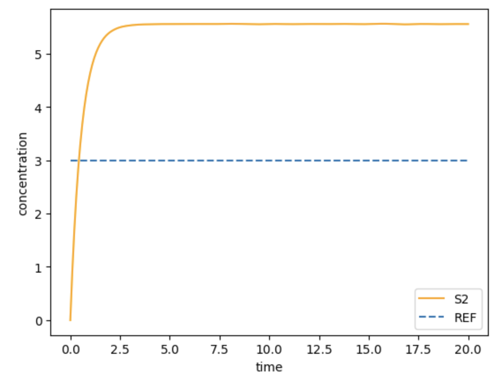
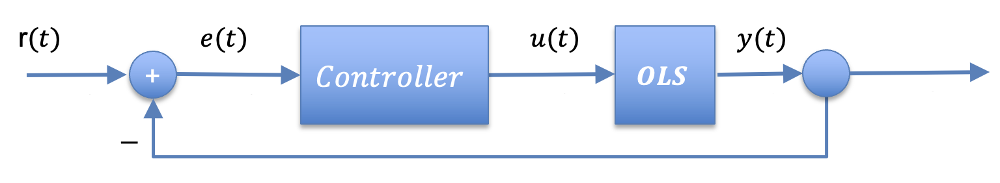
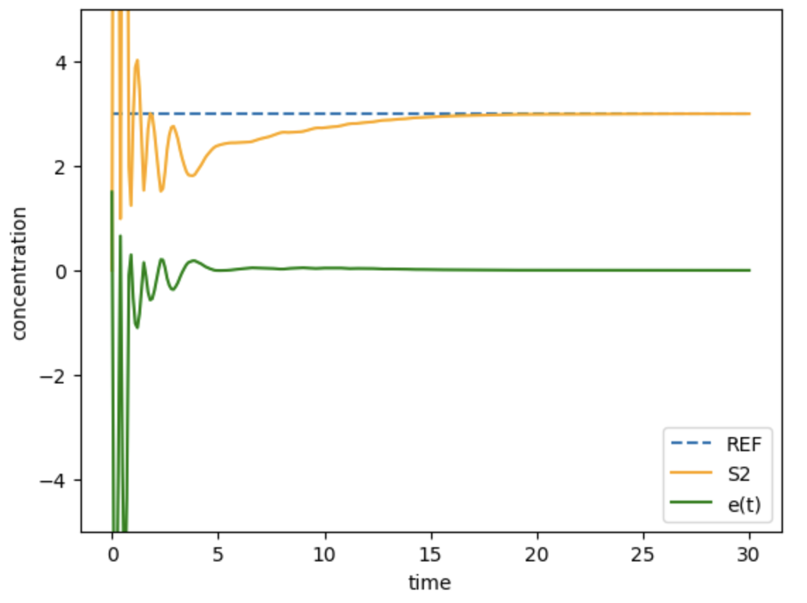

Modeling Closed Loops
=====================

.. highlight:: python
   :linenothreshold: 5

Here, we illustrate how to use ``controlSBML`` to model a closed loop system
for the SBML model.
Most of the work is done by the
`CalTech control library <https://python-control.readthedocs.io/en/0.9.2/>`_.

For the open loop system, we use the Antimony model below.

.. code-block:: python

    SIMPLE_OLS_MODEL = """
        J1: S1 -> S2; S1
        J2: S2 -> S1; S2
        J3: S2 -> ; k*S2
        S1 = 10; S2 = 0;
        k = 0.8
    """

.. end-code-block

Open loop system
################

Suppose we want the response to a unit step in ``S1`` to
be that ``S2`` is 3.
That is, ``REF = 3``.
To analyze well does the open loop system achieve this goal,
we use the following script, which produces the plot below.

.. code-block:: python

    # Desired value for S2
    REF = 3
    # Open loop system
    ctlsb = ctl.ControlSBML(SIMPLE_OLS_MODEL,
        input_names=["S1"], output_names=["S2"])
    simple_ols = ctlsb.makeNonlinearIOSystem("simple_ols")
    # Plot the impulse response response relative to reference
    times = [0.1*n for n in range(201)]
    time_response = control.input_output_response(simple_ols,
        times, X0=ctl.makeStateVector(simple_ols), U=0)
    plotTimeResponse(time_response, ["S2"], is_legend=False)
    plt.plot([times[0], times[-1]], [REF, REF], linestyle="--")
    plt.legend(["S2", "REF"])

.. end-code-block

Controller
##########

To achieve our control objective, we will construct a closed
loop system, as depicted in the block diagram below.
This system includes the original open loop system, and
it adds a controller.

We will use a proportional-integral (PI) controller.
This controller is the two controllers.
A proportional controller (P) and an integral controller (I).
The equation for the proportional controller is
:math:`u(t) = k_P e(t)`.
The equation for the integral controller is
:math:`u(t) = k_I\int_0^t e(u) du`.
Thus, the equation for the PI controller is:

.. math:: 
    
        \dot{ x}(t)  &=  e(t) \\
        u(t)      &=  k_P e(t) + k_I x(t)

Modeling the PI controller as a ``control.NonlinearIOSystem``
object requires that we construct functions that correspond to
the two state equations above.
The ``updfcn`` function
describes the derivative of state;
the ``outfcn`` function produces the outputs from the
current values of state.
Since our model does not include a separate element
for calculating :math:`e(t)`, this is done inside
the controller.
Thus, these functions input :math:`y(t)`.
The full collection of arguments to the functions are:
:math:`t`, :math:`x(t)`:, and :math:`y(t)`.

.. code-block:: python

    # Calculate derivative of state
    def updfcn(t, x, y, _):
        # Accumulate the control error
        # t: float (time)
        # x: array-float (state)
        # y: array-float (output from OLS)
        # returns: array-float (derivative of state)
        dx = REF - y[0]
        return dx

.. end-code-block

.. code-block:: python

    # Calculate output value
    kP = 0.5
    kI = 0.1
    def outfcn(t, x, y, _):
        # Calculate the output from the input
        # t: float (time)
        # x: array-float (state)
        # e: array-float (inputs)
        # returns: array (output)
        new_err = REF - y[0]
        output = kI*x[0] + kP*new_err
        return output

.. end-code-block

Notice that we introduced a new variable :math:`x(t)`.
This is a state variable.
It is used to calculate the integral of the control errors.

Now we can construct the ``control.NonlinearIOSystem`` object.

.. code-block:: python

    controller = control.NonlinearIOSystem(
          updfcn,
          outfcn,
          states=1,
          inputs=['in'],
          outputs=['out'],
          name='controller')

.. end-code-block

In addition to specifying the update and output functions,
this constructor also indicates the number of internal states
(one, :math:`x(t)`), the name of the input to the
controller (``in``) and the name of the output from the
controller (``out``).
These names are used later when we connect the controller
to the open loop system.

Closed loop system
##################

The next step is to connect the controller with the OLS.
Specifying these connections requires that we have
names for the inputs to elements and the outputs
from elements.
For example, the controller generates an output
signal named ``output``; its name is
``controller.output`` (because we named this element
``controller`` in the constructor).

``ctl.ControlSBML.makeNonlinearIOSystem`` creates A
``NonlinearIOSystem`` object with predefined names for the
inputs and outputs.
For example, ``simple_ols`` has the input
``simple_ols.S1`` and the output ``simple_ols.S2``.

Connects are specified by
a collection of input and output
relationships specified by a python ``list``.
The first element of the list is the name of the signal source;
the second element is a signal destination (an input
to a control element).
So, to connect the output from ``simple_ols`` to the
input to the controller, we use the list
``[S2, controller.in]``.

The ``control.interconnect`` objects are connections
of ``NonlinearIOSystem`` elements.
Below is a constructor for the model we are
building.
Note that the first argument of the constructor
is the list of ``NonlinearIOSystem`` objects
being interconncted.
``inplist`` and ``outlist`` are lists of the inputs to
and outputs from the assembly of
``NonlinearIOSystem`` objects.

.. code-block:: python

    # Create the closed loop system
    simple_closed = control.interconnect(
    [simple_ols, controller],       # systems
    connections=[
        ['simple_ols.S1', 'controller.out'],
        ['controller.in',  'simple_ols.S2'],
    ],
    inplist=["controller.in"],
    outlist=["simple_ols.S2", "controller.out"],
    )

.. end-code-block

Evaluation
##########

The final step is to evaluate the performance of the above system.
This is done in the same way as what we did for ``simple_ols``
using ``control.input_output_response``.
One consideration here is that this function
requires specifying the initial state for
*all* elements in ``simple_closed``.
Even with just two elements, this can be complicated.
The function ``ctrl.makeStateVector`` handles this problem
although there are some subtlties.

.. code-block:: python

    initial_state = ctl.makeStateVector(simple_closed)
    times = [0.1*n for n in range(301)]
    time_response = control.input_output_response(simple_closed,
          times, X0=initial_state)
    plt.plot([times[0], times[-1]], [REF, REF], linestyle="--")
    stmts=["plt.ylim([-5, 5])"]
    stmts.append('plt.legend(["REF", "S2", "e(t)"])')
    plotTimeResponse(time_response, 
          ["S2", "controller.out"],
          stmts=stmts, is_legend=False)

.. end-code-block

