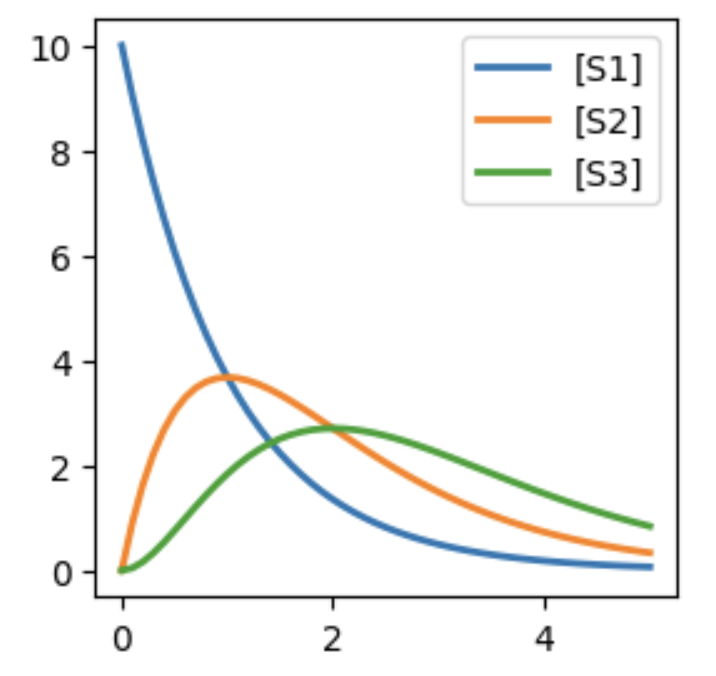
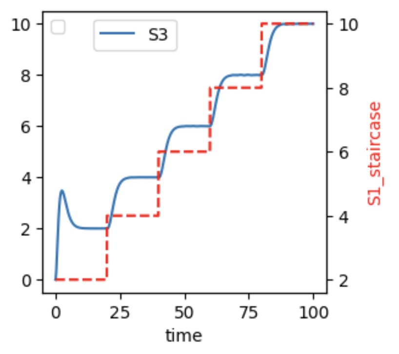
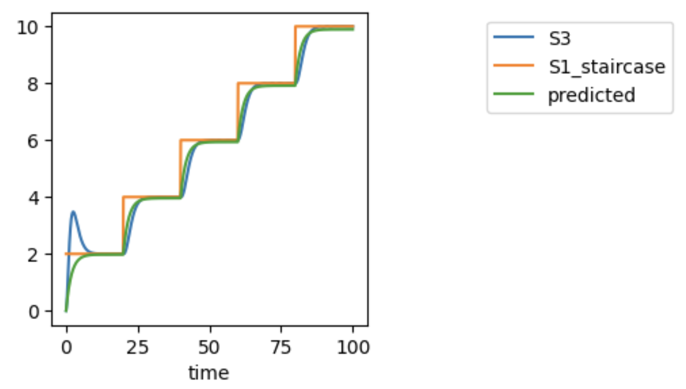

System Identification
=====================

.. highlight:: python
   :linenothreshold: 5

``controlSBML`` methods that can assist with fitting a SISO transfer function
to an SBML model.
There is one preparatory step and then
two analysis steps.

To illustrate these steps, we introduce the following ``LINEAR_MODEL``:

.. code-block:: python

    LINEAR_MODEL = """
    J1: S1 -> S2; k1*S1
    J2: S2 -> S3; k2*S2
    J3: S3 -> ; k3*S3
    S1 = 10; S2 = 0; S3 = 0

    k1 = 1
    k2 = 1
    k3 = 1
    """

.. end-code-block

Simulating this model produces the output below:

In the preparatory step, we construct a ``SISOTransferFunctionBuilderObject``.
This involves first constructing a ``ControlSBML`` object and from this
obtaining a ``SISOTransferFunctionBuilder`` object.
For the former, we specify ``S1`` as the input to the system,
and ``S2`` as the output.

.. code-block:: python

    linear_ctlsb = ctl.ControlSBML(LINEAR_MODEL,
          input_names=["S1"], output_names=["S3"])
    linear_builder = linear_ctlsb.makeSISOTransferFunctionBuilder()

.. end-code-block

The constructor for ``SISOTransferFunctionBuilder`` has a number of optional keyword
arguments, such as specifying as providing a way to explicitly specify the
input and output names of the SISO system.

Now we are ready for the first analysis step--evaluating the operating region for the SISO system.
This is done by examining the relationship between values of the input, ``S1`` in our
example, and the output, ``S3``.
This relationship is assessed by presenting the SISO system with a *staircase* of
input values.
A staircase is a sequence of step inputs that have the same change in magnitude and time duration.

.. code-block:: python

    linear_builder.plotStaircaseResponse(initial_value=2, final_value=10, num_step=5,
          figsize=(3,3), legend_crd=(0.5, 1), end_time=100)

.. end-code-block

The staircase is specified by ``initial_value``, ``final_value``, and ``num_step``.
Various plotting options are available as well.
The left y-axis of the plot is for the output (``S3``), and the right y-axis is for the staircase function.
We see that the output changes in close connection with changes in the input.
Sometimes you will need to lengthen the simulation time in order for the system
to settle to see these changes.

In the second analysis step, we determine an appropriate transfer function for
the SBML model.
The approach here is to find a transfer function that accurately predicts the system
output from its input over the operating region.
The workflow is:

1. The user chooses a degree of the numerator and denominator polynomials of the transfer function.
2. The user runs the method ``fitTransferFunction``.
3. If the fit is good, the user may consider reducing the degree of the numerator and/or denominator polynomials to avoid overfitting.
4. If the fit is poor, the user may increase the degree of the numerator and/or denominator polynomials.
5. If the fit is good and the polynomials have a low degree, this step is completed.

.. code-block:: python

    fitter_result = linear_builder.fitTransferFunction(
          1, 2, final_value=10, initial_value=2, end_time=100)
    ctl.plotOneTS(fitter_result.time_series,
          figsize=(3,3), legend_crd=(2,1))
    
.. end-code-block

We see that the predicted value of ``S3`` coincides closely with the value of ``S3`` from
the nonlinear simulation.
So, it seems that we have a good transfer function.
The ``control.TransferFunction`` object is in ``fitter_result.transfer_function``;
it is :math:`\frac{5.368}{10s + 5.424}`.
Other useful properties are:

* ``nfev`` is the number of different transfer functions that were evaluated to find the fit
* ``parameters`` contains the parameter values
* ``redchi`` is the reduced ChiSq for the fit
* ``stderr`` contains the standard deviations of the parameter values
* ``time_series`` is a ``Timeseries`` object with the input, nonlinear simulated output, and predicted value of the output
* ``transfer_function`` is the fitted transfer function.
