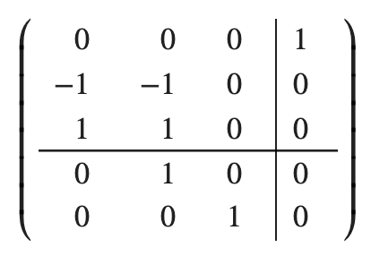
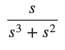
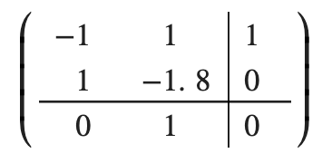
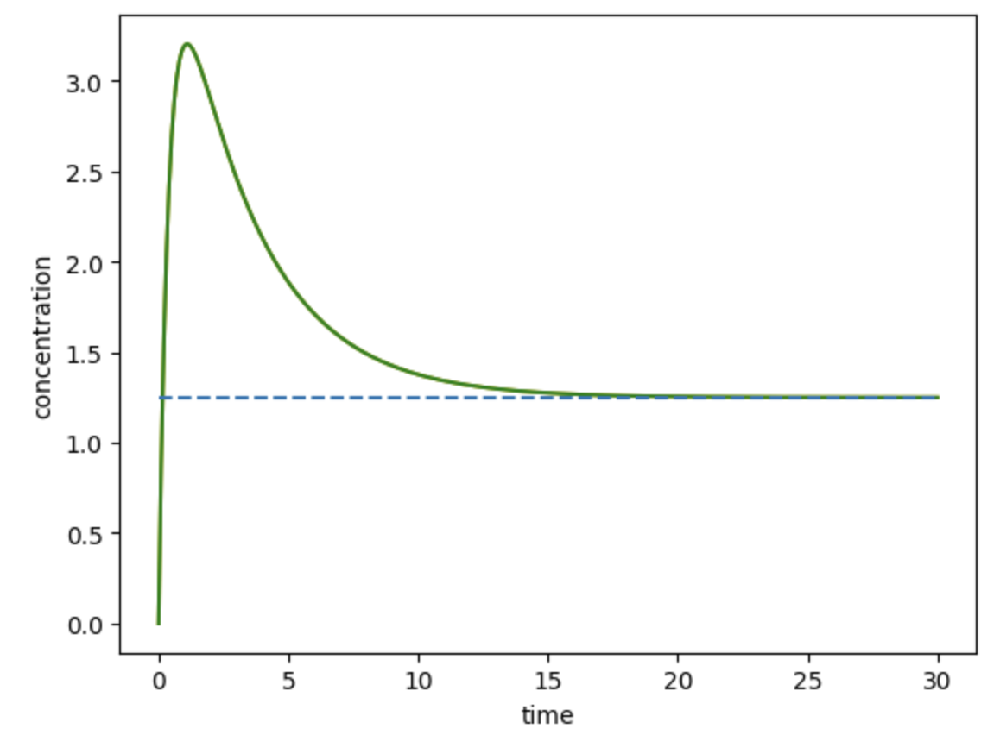
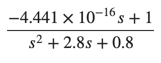

``ctl.ControlSBML``
===================

.. highlight:: python
   :linenothreshold: 5

``controlSBML`` provides ways to use an SBML model to construct an
object representing a system
model that can be used by the ``control`` package.
Two kinds of ``control`` objects can be constructed.
The first,
``control.NonlinearIOSystem``,
wraps an entire nonlinear SBML model.
This allows the ``control`` package to do the same kind of detailed
simulations that are provided by SBML simulators as as ``libroadrunner``
and ``Copasi``.
The second object,
``control.StateSpace``, provides a linear approximation to the SBML model.
``control.NonlinearIOSystem`` and
``control.StateSpace`` objects are constructed from an
``ctl.ControlSBML`` object.

In the sequel, we use the following
Antiimony representation of an SBML model.

.. code-block:: python

    SIMPLE_MODEL = """
        species E1;
        J1: S1 -> S2; S1 + E1
        S1 = 10; S2 = 0; E1 = 1;
    """

Constructors
############
We begin with constructing a ``ctl.ControlSBML`` object.
This requires having a representation of an SBML model.
This can be an XML file, an XML URL, an antimony file,
or a ``libroadrunner`` object.
We refer to any of these representations of the SBML model as
a *model reference*.
The following constructs ``ctl.ControlSBML`` object for this model.

.. code-block:: python

    ctlsb = ctl.ControlSBML(SIMPLE_MODEL)

This object has a number of useful properties.

* ``ctlsb.antimony`` is the Antimony string that corresponds to the model reference in the constructor.
* ``ctlsb.roadrunner`` is the ``libroadrunner`` object for the model reference in the constructor.
* ``ctlsb.state_ser`` is a ``pandas`` ``Series`` that provides the values of the concentrations of floating species (the state variables).
* ``ctlsb.setTime(time)`` runs the simulation from time 0 to a desired time. This updates ``ctlsb.state_ser``.

To create an object that is more useful for control analysis,
you should specify at least one *input* and at least one *output*.
An input is a chemical species that can be manipulated by
increasing or decreasing its value.
An output is a chemical species or reaction flux that can be
read.
An example of this constructor is:

.. code-block:: python

    ctlsb = ctl.ControlSBML(SIMPLE_MODEL,
        input_names=["E1"], output_names=["S2"])

Note that both ``input_names`` and ``output_names``
are lists of strings.
Inputs and outputs must be specified to make use of
subsequent capabilities of ``ctl.ControlSBML``.

``control.NonlinearIOSystem``
#############################

The method ``ctl.ControlSBML.makeNonlinearIOSystem`` constructs
a ``control.NonlinearIOSystem`` object for an SBML model.
The ``control.NonlinearIOSystem`` object provides a way to use
many of the capabilities of the control system library.
For example,

.. code-block:: python

    ctlsb = ctl.ControlSBML(SIMPLE_MODEL,
            input_names=["E1"], output_names=["S1", "S2"])
    sys = ctlsb.makeNonlinearIOSystem("simple")

``sys`` is a ``control.NonlinearIOSystem`` object,
and the following simulates this system for 5 s.

.. code-block:: python

    times = [0.1*n for n in range(51)]
    time_response = control.input_output_response(sys,
        times, X0=ctl.makeStateVector(sys))

``ctlsb`` is constructed to have the input ``E1`` and the outputs ``S1`` and ``S2``.
``sys`` is a ``control.NonlinearIOSystem`` object
that wraps the SBML model.
``time_response`` is a ``control.TimeResponseData`` object.
The simulation requires knowlege of initial values for all state variables,
which is provided by the method ``ctl.makeStateVector``.

Going a bit further, we introduce a plotting function for
the ``control.TimeResponseData`` object.

.. code-block:: python

    def plotTimeResponse(time_response, output_names,
          is_legend=True, stmts=None):
        # Plots the results of running a simulation
        outputs = time_response.outputs
        times = time_response.time
        colors = ["orange", "green"]
        for idx in range(len(output_names)):
            if np.ndim(outputs) > 1:
                plt.plot(times, outputs[idx,:], c=colors[idx])
            else:
                plt.plot(times, outputs, c=colors[idx])
        if is_legend:
            _ = plt.legend(output_names)
        if stmts is None:
            stmts = []
        for stmt in stmts:jj
            exec(stmt)
        plt.xlabel("time")
        plt.ylabel("concentration")

We execute the statement below to plot the simulation results.

.. code-block:: python

    plotTimeResponse(time_response)

.. image:: images/simple_model_plot.png
  :width: 400

``control.StateSpace``
######################

A state space model is a linear system of differential equations
in which there are
:math:`n` states,
:math:`p` inputs, and
:math:`q` outputs.

.. math:: 
    
        \dot{\bf x}  &=  {\bf A} {\bf x} + {\bf B} {\bf u} \\
        {\bf y}      &=  {\bf C} {\bf x}

where:

.. math:: 

    {\bf x} \text{ has dimension }  n \times 1 \\
    {\bf u} \text{ has dimension }  p \times 1 \\
    {\bf y} \text{ has dimension }  q \times 1 \\
    {\bf A} \text{ has dimension }  n \times n \\
    {\bf B} \text{ has dimension }  n \times p \\
    {\bf C} \text{ has dimension }  q \times p \\

:math:`{\bf x}` is the state variable,
:math:`{\bf u}` is the input vector,
and :math:`{\bf y}` is the output.

``controlSBML`` constructs a ``control.StateSpace``
object for an SBML model as follows.
The state variables are
floating species.
The :math:`{\bf u}` are names of floating
species that are manipulated inputs (``input_names``).
The :math:`{\bf y}` are the names
of measured outputs (``output_names``), either
floating species or names of reactions whose fluxes are output.
A
linear approximation for an SBML model is constructed
using the Jacobian of the state variables at a specified operating point.
The operating point is a simulation time at which state variables are assigned their values
to calculate the Jacobian.

Once a ``ctl.ControlSBML`` object has been constructed,
the method ``makeStateSpace`` is used to create
a ``control.StateSpace`` object.
This is illustrated below to construct a ``control.StateSpace`` object using
time 0 as the operating point.

.. code-block:: python

    ctlsb = ctl.ControlSBML(SIMPLE_MODEL,
        input_names=["S1"], output_names=["S2"])
    state_space = ctlsb.makeStateSpace(time=0)

The resulting state space model is represented below.
:math:`{\bf x}` is a 3 dimensional vector
that correspond to the state variables (floating species)
``E1``, ``S1``, and ``S2``.
:math:`u` and :math:`y` are scalars (and so
are not in **bold**).
:math:`{\bf A}` is in the upper left;
:math:`{\bf B}` is in the upper right;
and :math:`{\bf C}` is in the lower left.
:math:`{\bf A}` is A
:math:`3 \times 3` matrix;
:math:`{\bf B}` is a :math:`3 \times 1` matrix;
and :math:`{\bf C}` is :math:`1 \times 3`.

We can construct a transfer function from a ``control.StateSpace``
object.
The transfer function for the above system is obtained by

.. code-block:: python

    transfer_function = control.tf(state_space)

and is displayed as

The DC gain for this transfer function is :math:`\infty`.
This makes sense since by having
a unti input for times :math:`\geq 0` and
a single reaction that consumes ``S1`` to produce ``S2``,
the output increases without bound.

Now consider a slightly different reaction network.

.. code-block:: python

    model = """
        J1: S1 -> S2; S1
        J2: S2 -> S1; S2
        J3: S2 -> ; k*S2
        S1 = 10; S2 = 0;
        k = 0.8
    """

    ctlsb = ctl.ControlSBML(model,
          input_names=["S1"], output_names=["S2"])
    state_space = ctlsb.makeStateSpace()

The state space matrices are:

We simulate and plot the response of the state space model
to a unit step in the input in ``S1``.

.. code-block:: python

    times = [0.1*n for n in range(301)]
    ss_time_response = control.forced_response(state_space,
          times, X0=[10, 0], U=1)
    plotTimeResponse(ss_time_response, is_legend=False)
    plt.plot([0, 30], [1.25, 1.25], linestyle="--")

The transfer function is

and so the DC gain is :math:`1/0.8=1.25`, which is
consistent with the plot.